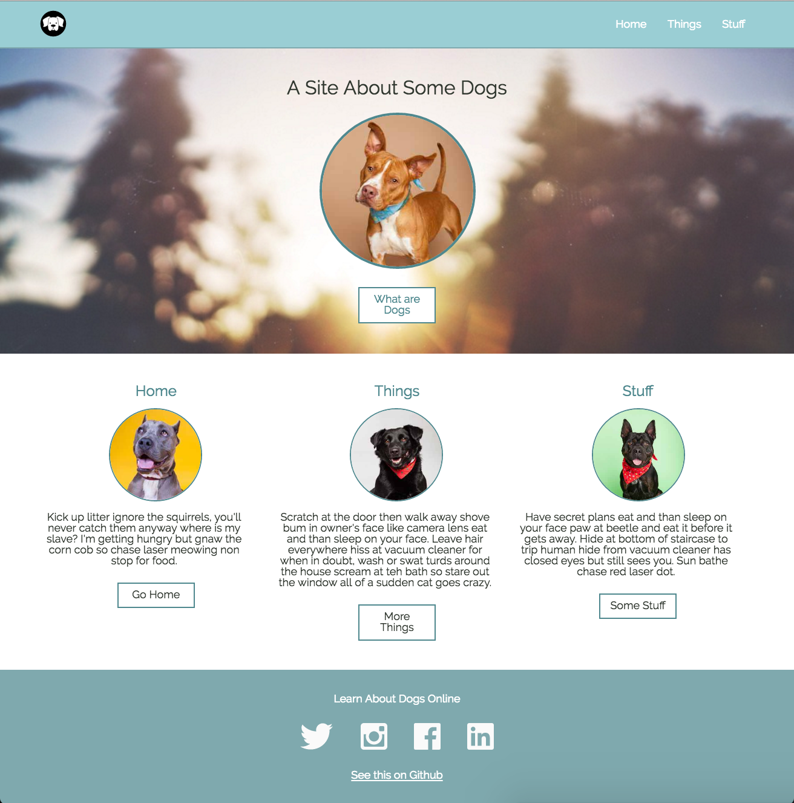
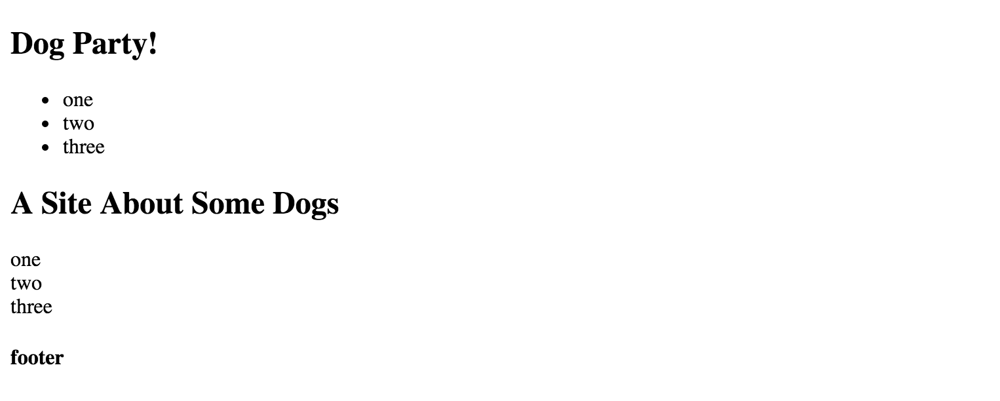
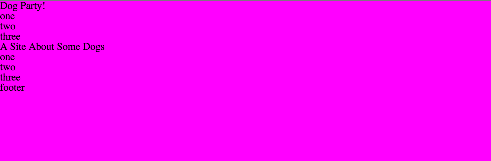
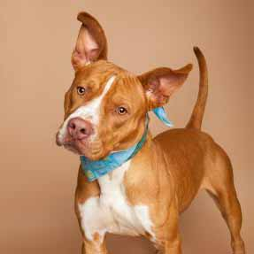
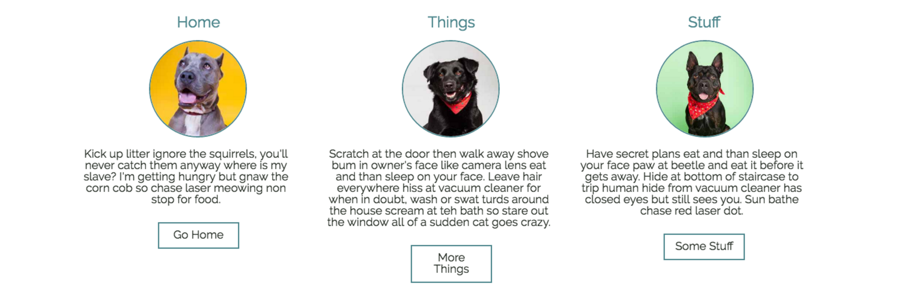

  ---
title: HTML and CSS fundamentals static site
length:
tags: html, css
---

### Goals

By the end of this tutorial, you will know/be able to:

* Have an understanding of how to write well constructed, semantic HTML
* Understand how to control the positioning of HTML elements on your page using CSS
* Gain clarity about how CSS is used to create and style your layout

### Building a Static Site

HTML and CSS are used everywhere on the web, and engaging and appealing pages can be built with a surprisingly small amount of code. In this tutorial we will build a liquid layout, one-page static site to help solidify our HTML and CSS fundamentals.

#### Start with the Structure

Just like you wouldn't build a house without framing the walls first, it's a good idea to write up the basic HTML structure of your site before you begin to add content and style your page.

Before we write any code, we need to set up our directory structure. Make a new project folder called "dog-party", and inside of that put the following things:

* a file named `index.html`
* a folder called "images" to hold all the images for the site
* a folder called "css" that contains:
* a file called `styles.css`
* a file called `reset.css`

Now, let's take a look at the site we want to build:



From this screen grab we can see that we have the following elements:

* a primary header bar with logo and navigation
* a hero unit with a full width background image, title, and call to action (CTA) button
* three columns with sub-headers, secondary content, images, and buttons
* a footer

Download the images [here](https://drive.google.com/folderview?id=0B_lPnjyMN6-CVFNNbEUwWVZ0Z0k&usp=sharing), and let's get started.

The first thing we'll do is break this layout down into semantic HTML tags to help us clarify how we want to build the page. Let's write up the skeleton HTML so we have a roadmap to follow as we work.

```HTML
<!doctype html>
<html>
  <head>
  </head>

  <body>
    <header>
      <h1></h1>
      <nav>
        <ul>
          <li></li>
          <li></li>
          <li></li>
        </ul>
      </nav>
    </header>

    <section></section>

    <section>
      <article></article>
      <article></article>
      <article></article>
    </section>

    <footer></footer>
  </body>
</html>
```

Let's walk through this from the top down:

First we have a `<header>` tag for our primary header. Within that we have an `<h1>` that will become our logo, and a  `<nav>` tag that's holding an unordered list that will become our primary navigation links.

Next, we have an empty `<section>` tag that will become our hero unit.

Below that, we have another `<section>` tag with three `<article>` tags. These will become our 3 columns.

And, finally, we have a `<footer>` tag.

Now that we have our roadmap, let's add a little placeholder content so we can open this page up in our browser and take a look:

```HTML
<!doctype html>
<html>
  <head>
    <title>Dog Party</title>
  </head>

  <body>
    <header>
      <h1>Dog Party!</h1>
      <nav>
        <ul>
          <li>How</li>
          <li>What</li>
          <li>Facts</li>
        </ul>
      </nav>
    </header>

    <section>
      <h2>A Site About Some Dogs</h2>
    </section>

    <section>
      <article>How</article>
      <article>What</article>
      <article>Facts</article>
    </section>

    <footer>
      <h4>footer</h4>
    </footer>
  </body>
</html>
```

Open your index.html file in your browser and take a look. It doesn't look like much yet, but we can see that the content hierarchy and structure makes sense.



Looking at this raw HTML, we can see that the browser has applied default styles for us and the headers and paragraphs are different sizes and font weights. That was nice of them! But, as we write our own styles for this page, these defaults could get in our way and make us write extra code. So, let's pull in a reset file to zero out these styles so we can start with a blank slate.  

While you can write your own as you gain experience and learn what your preferences are, there are several great open source reset file options we can use to get us up and running quickly. [Go to this site](http://meyerweb.com/eric/tools/css/reset/), and copy the code for the reset file (remember to include the lines of code crediting Eric Meyers, the developer who wrote this! Always give credit where credit is due).  

Now, back in your project, paste this code into `reset.css`. Since this code is clearing out all the default styles for us, it's a good idea to keep it organized in it's own file. That way we can keep our `styles.css` file dedicated to the new styles we write.

Back in the browser, refresh you page. What do you see?

Huh. It looks the same. Why isn't the reset file doing anything?

Because we haven't connected our HTML and our CSS yet. It's an easy fix. In the `<head>` tag of our site, let's add the link to the CSS file:

```HTML
<link rel="stylesheet" type="text/css" href="css/reset.css">
```

Now refresh your page again. All the text should be the same size now! That means our HTML and CSS files are working together properly. And since we know we'll need to hook up our custom stylesheet, let's do that now. Add this line *after* the link to your reset file:

```HTML
<link rel="stylesheet" type="text/css" href="css/styles.css">
```

We put the link to `styles.css` after `reset.css` because if we put `reset.css` after, it would cancel out many of our styles! That's an example of the "cascade" in CSS. The last style specified for something will be what the browser uses (it cascades down to the last style), so if the reset file is put after the styles you write, its styles will take precedence over yours.

*Note* it's important to put the link to the stylesheet in the  `<head>` tag and not the `<header>` tag. The `<head>` tag is where the metadata for the page goes, which means things like links to stylesheets, fonts, and our page title live there but actual content for the user -- like the navigation elements in our `<header>` -- does not.

To double check that our `styles.css` is working properly, let's set a loud color as the background on the `<body>` tag -- don't worry, we won't leave this color in our styles, we just want to do a quick sanity check to make sure everything is working as expected. In `styles.css` add a magenta background to the body:

```CSS
body {
  background-color: magenta;
}
```

Refresh your browser and you should see a very bright page.



So, now that we know our style sheet is linked up correctly, let's begin styling our page. Go ahead and get rid of that magenta background and let's get started. We'll start at the top and work our way down.

##### Changing Fonts

First, we'll pull in the font we want to use. Let's use [Raleway](https://fonts.google.com/?query=raleway&selection.family=Raleway). To use this font in our site, we only need to add two lines of code. One goes in the `<head>` of our index.html file to pull in the fonts (like we pull in our stylesheets) and the other goes in our styles.css to specify where in our site we want this new font to be applied:

Add this in the `<head>` of index.html
```html
<link href="https://fonts.googleapis.com/css?family=Raleway" rel="stylesheet">
```

and this in styles.css (we specify the font on the `<body>` tag because we want this to be the font that is used for all text on our page):

```css
body {
  font-family: 'Raleway', sans-serif;
}
```

Refresh your page in the browser and you should see that the fonts have changed!


##### Making a Navigation Bar

The first element we see is the header bar at the top of the page. We can see that we have a logo on the left side and three links on the right side.

We've written the html structure for this section, let's take a look at it:

```html
<header>
  <h1>Dog Party!</h1>
  <nav>
    <ul>
      <li>How</li>
      <li>What</li>
      <li>Facts</li>
    </ul>
  </nav>
</header>
```

We know that we want to have a colored header bar, let's start there. Add this to your CSS.

```CSS
header {
  background: #92E0E5;
  color: white;
  height: 50px;
  padding: 0 25px;
}
```

Great! Our header bar is teal now. Next, we know that we want the three links to be on the far right side of the header bar. They're currently still in the normal page flow, and over on the left side under the `<h1>` text. Let's go ahead and move them over to the right.  

There are several different ways to accomplish this, but we'll use a float to move the `<nav>` element holding our navigation links over to the right. This will pull the `<nav>` out of the normal page flow and push it over to the right. We want to target the `<nav>` that is within the `<header>`, and we write it like this:

```CSS
header nav {
  float: right;
}
```

*remember: refresh your browser regularly as you work to make sure that the styles you write are doing what you intend and expect them to do!*

When we reload the page we see that something still not quite right. The `<nav>` has been pushed over to the right, but now it has been pushed down out of the header. That's weird, what's going on?

If we inspect the `<h1>` in the browser using our developer tools, we see that it's taking up the entire width of the page. That is why the `<nav>` is being pushed down out of the header. This is happening because `<h1>` tags are *block level* elements, so by default they will fill the entire row that they are on.  

We can solve this by floating our header's h1 to the left. It won't look that different since `float: left` will keep the h1 on the left side of the screen, but the reason this helps us is because the float pulls the h1 out of the normal page flow and allows us to have two elements on the same row. Now both the h1 and the nav will be aligned nicely and inside of the header bar. Our CSS for the `<nav>` and `<h1>` looks like this:

```CSS
header h1 {
  float: left;
}

header nav {
  float: right;
}
```

Great! Now let's get those `<li>` elements to be in a row instead of stacked on top of each other. Like we found with with our h1, `<li>` is a block level element. A simple approach to make them align horizontally rather than vertically is to change the `<li>` tags from block level elements (the default) to inline elements. This will allow them to all sit next to each other on the same row. Here's the code:

```CSS
header h1 {
  float: left;
}

header nav {
  float: right;
}

nav li {
  display: inline-block;
}
```

If we look at our example website we see that we actually have a logo where the `<h1>` text is. We can do this with an approach called "image text replacement". In short, this approach allows you to keep the search engine-friendly h1 text, but swaps it out for an image. You can read about the ins and outs of this approach [in this old but good article by Chris Coyier](https://css-tricks.com/header-text-image-replacement/). Let's look at the code and then walk through it:

```css
header h1 {
  float: left;
  text-indent: -9999px;
  background: url('../images/dog-icon.svg') no-repeat;
  height: 35px;
  width: 35px;
  margin-top: 8px;
}
```

We still have our `float: left`, but we've added a few more lines: `text-indent` is shoving the actual text of our h1 negative nine thousand nine hundred and ninety nine pixels off the left side of the screen. We can't see it as users now, but it's still a part of the site content so we get the SEO benefits. Next, we set our `dog-icon.svg` as a *background image*. We set the width and height of the h1 itself, so we have a nicely sized icon. Finally, we add 8px of margin to the top of the h1 to vertically center the icon in the header.

That looks pretty close! We just need to get those `<li>` elements vertically centered in the header. We can do that by adding padding to them. The code looks like this:

```css
nav li {
  display: inline-block;
  padding: 17px 10px;
}
```

We just added 17px of padding to the top and bottom of each li, and 10px padding to the left and right sides. This centered them vertically in the header and gave them a little breathing room.

Let's add a hover to those li elements so our users get some visual feedback as they mouse over them. We'll make the background and text color on the `<li>` change on `:hover`. Here's the code:

```css
nav li {
  display: inline-block;
  padding: 17px 10px;
}

nav li:hover {
  background: #3F8DA7;
  color: white;
  cursor: pointer;
}
```

And that's our header!


##### Making a Hero Unit

Next thing to tackle is the hero unit. This may sound like a strange term, but it's common way to describe a large splash section on a landing page. It basically just means that this section is the first one people will see, so it needs to make a great first impression -- it's a hero.

Let's go through what our hero unit layout needs before we start styling. We'll need a full width background image, a page header, a primary image, and a call to action (also referred to as a "CTA") button.

As a first step, let's add an `id` of "hero" to the `<section>` that will be wrapping our hero unit. This will let us target that specific section with our styles, and since it's unique to this section we can use an `id` because we know we won't have another hero unit.

```html
<body>
  <header>
    <h1>Dog Party!</h1>
    <nav>
      <ul>
        <li>How</li>
        <li>What</li>
        <li>Facts</li>
      </ul>
    </nav>
  </header>

  <section id="hero">
    <h2>A Site About Some Dogs</h2>
  </section>

  <section>
    <article>How</article>
    <article>What</article>
    <article>Facts</article>
  </section>

  <footer>
    <h4>footer</h4>
  </footer>
</body>
```

We'll also need to add the additional content to our `#hero` section.

```html
<section id="hero">
  <h2>A Site About Some Dogs</h2>
  
  <a href="http://corgis-in-space.tumblr.com/" target="_blank">What are Dogs</a>
</section>
```

If we refresh our page, it doesn't look great. But now that we have our content in index.html, we can start styling it. The first thing to tackle is the full width background image, and because we put our logo into the header as a background image we're familiar with the syntax. Let's do that first:

```css
#hero {
  background: url('../images/park.jpg') no-repeat;
  background-size: cover;
  text-align: center;
  padding: 50px 0;
  margin-bottom: 50px;
}
```

That looks much better! But what is this CSS doing? On the first line we set our background image to be `park.jpg` and say that it should not repeat (by default, background images repeat, or tile, from left to right, top to bottom).  

On the next line `background-size: cover` tells the image to fully fill the space available automatically, which means that you won't get awkward white space on the sides or bottom as you move between large and small screen sizes.  

`text-align: center` centers all the content inside of our `#hero` section, including text *and* images, so our content will be neatly aligned in the center of the page.  

And finally, `padding: 50px 0` sets internal padding of 50px at the top and bottom of the `#hero` section so the content inside has some breathing room and doesn't feel too crowded, and a `margin-bottom` of 50px gives the content below our hero unit some space.

Hmm. Something isn't right. Why are the primary image and CTA link on the same line? If we inspect those elements in the browser, we see that neither is a block-level element. In fact, both `` and `<a>` tags are inline by default. We can easily fix this by setting the `` to `display: block`.

```css
#hero img {
  display: block;
}
```

Now that the image and the CTA link are on different rows, we can style the image. We'll need to re-center it, add a border-radius to make it a circle, and add a colored border. Here's the code:

```css
#hero img {
  display: block;
  margin: auto;
  border-radius: 50%;
  border: 5px solid #3F8DA7;
}
```

Now, let's make the `<h2>` a bit larger so it looks more like a title:

```css
#hero h2 {
  font-size: 30px;
}
```

We could use some margin on the bottom of the `<h2>` and the primary image. Let's add that.

```css
#hero img {
  display: block;
  margin: auto;
  margin-bottom: 25px;
  border-radius: 50%;
  border: 5px solid #3F8DA7;
}

#hero h2 {
  font-size: 30px;
  margin-bottom: 25px;
}
```

All that's left is styling our CTA link:

```css
#hero a {
  background: white;
  border: 5px solid #3F8DA7;
  color: #3F8DA7;
  padding: 5px 10px;
  text-decoration: none;
}

#hero a:hover {
  padding: 5px 10px;
  background: #3F8DA7;
  color: white;
}
```

Refresh again to make sure that everything looks as expected. If it does, our hero unit is complete.


##### Making 3 Columns



In this content section, we have three columns that sit side by side. If we look at them, we see that they all have the same structure, style, and content organization. They consist of a title, an image, a block of text, and a button. We know that each column will have the same structure with different content, so we will use the same base HTML and styles for all three and then simply plug in the unique content for each. This lets us keep our code DRY and avoid duplication, and gives us the flexibility to easily reuse these styles elsewhere in our site down the road.  

Note that we use the class `three-col` on all three of the columns: we do this because we want to apply specific styles that will make these blocks of content into three columns, and we want to use *the same styles* to accomplish that on all three. We don't apply the styles directly to the `<article>` tag because it's very likely that at some point in the future our site could have other `<article>` tags that are not in a three column grid. We might also want to use a different tag in a three column grid down the road -- we could just as easily put this class on a `<section>`, `<div>`, or other tag and get the same three column layout results. It is good practice to consider long-term flexibility as you write your HTML and CSS.

Let's update our HTML structure so all three columns are the same:

```html
  <section>
    <article class="three-col">
      <h3>How</h3>
      
      <p></p>
      <a href=""></a>
    </article>

    <article class="three-col">
      <h3>What</h3>
      
      <p></p>
      <a href=""></a>
    </article>

    <article class="three-col">
      <h3>Facts</h3>
      
      <p></p>
      <a href=""></a>
    </article>
  </section>
```

If we refresh our page now, not a whole lot has changed. Time to put in content! Let's add images and text. We can grab a few lines of placeholder text from a [lorem ipsum text generator](http://www.meettheipsums.com/).

```html
  <section>
    <article class="three-col">
      <h3>How</h3>
      
      <p>
        Nap all day Gate keepers of hell yet stares at human while pushing stuff off a table. Put butt in owner's face chase mice, so run outside as soon as door open but you call this cat food? stare at the wall, play with food and get confused by dust.
      </p>
      <a href="https://en.wikipedia.org/wiki/Dog">Link One</a>
    </article>

    <article class="three-col">
      <h3>What</h3>
      
      <p>
        Soft kitty warm kitty little ball of furr. Hunt anything that moves meowing non stop for food stand in front of the computer screen knock dish off table head butt cant eat out of my own dish, then cats take over the world hide when guests come over.
      </p>
      <a href="http://www.dog-adoption-and-training-guide.com/about-dogs.html">Link Two</a>
    </article>

    <article class="three-col">
      <h3>Facts</h3>
      
      <p>
        Destroy the blinds chase imaginary bugs, so lie on your belly and purr when you are asleep. Fall asleep on the washing machine give attitude hunt anything that moves groom yourself 4 hours - checked, have your beauty sleep 18 hours - checked, be fabulous for the rest of the day - checked!
      </p>
      <a href="http://www.livescience.com/13305-facts-dog-breeds-genetics-pets.html">Link Three</a>
    </article>
  </section>
```

Now when we refresh the page we see that we have all our content, but it's looking pretty rough. The three articles are stacked on top of each other, all the content is left justified, and our paragraph text is stretching the full width of the screen. Let's start fixing this. We'll start by making our columns actually be columns. Time to utilize our `three-col` class on the opening article tags -- we can add positioning styles, and have flexibility if we at some point want to have other elements on the page be in a three column layout. In our CSS we'll write the following:

```css
.three-col {
  width: 30%;
  display: inline-block;
}
```

Refresh your page and we'll see that this got our content into columns, but it would be nice if there was an easy way to have them all aligned so the tops of the columns are level. Turns out there is a simple way to do just that, with the [`vertical-align` property](https://developer.mozilla.org/en-US/docs/Web/CSS/vertical-align). While we're at it, let's go ahead and center the content and give our columns some right and left margin, too.

```css
.three-col {
  width: 30%;
  display: inline-block;
  text-align: center;
  vertical-align: top;
  margin: 0 10px;
}
```

Let's get the images to be a consistent size, put that fancy border radius on them to make them circles, give them a teal border, and add some margin to top and the bottom so the images have some breathing room.

```css
.three-col img {
  border-radius: 50%;
  border: 3px solid #3F8DA7;
  height: 200px;
  width: 200px;
  margin: 25px 0;
}
```

Now all that's left on our columns is to get our `<a>` tag styled as a button. Hmm. Didn't we already style an `<a>` tag like a button in our hero unit? Why write the same CSS twice, let's just reuse what we already have. To do this we need to understand the rules of [CSS specificity](https://css-tricks.com/specifics-on-css-specificity/). When we styled the `<a>` tag in the hero unit, we made it specific to that block of content by putting the styles on `#hero a`. Since the `<a>` tags in our columns aren't within an element that has an id of `hero`, the button styles we used in the hero unit aren't being applied to our column buttons.

To make our existing styles be applied to all our `<a>` tags, our [selectors](https://developer.mozilla.org/en-US/docs/Web/Guide/CSS/Getting_started/Selectors) will change from this:

```css
#hero a {
  background: white;
  border: 5px solid #3F8DA7;
  color: #3F8DA7;
  padding: 5px 10px;
  text-decoration: none;
}

#hero a:hover {
  padding: 5px 10px;
  background: #3F8DA7;
  color: white;
}
```

To this:


```css
a {
  background: white;
  border: 5px solid #3F8DA7;
  color: #3F8DA7;
  padding: 5px 10px;
  text-decoration: none;
}

a:hover {
  padding: 5px 10px;
  background: #3F8DA7;
  color: white;
}
```

In your CSS, try removing `#hero` from your current `<a>` styles and refresh your page. You should see that all the `<a>` tags have the same styles now! When we refresh out page, we see that our buttons are really crowding the paragraph text. Let's go ahead and add a margin-bottom to the `<p>` tags in our columns.

```css
.three-col p {
  margin-bottom: 40px;
}
```

##### Making The Footer


The last thing to style is our footer. Let's start by building the HTML structure for this final grouping of content. We see that we have three blocks of information: a subhead, a collection of social media icons, and a link back to the repo.

```html
<footer>
  <h4></h4>
  <ul>
    <li></li>
    <li></li>
    <li></li>
    <li></li>
  </ul>
  <a href="" target="_blank"></a>
</footer>
```

This structure should look familiar. We have an `<h4>` level header as our subhead, we'll put our social media icons in `<li>` within an unordered list the same way we made our main navigation links in our header, and we have an anchor tag for our link.

Let's add our content:


```html
<footer>
  <h4>Learn About Dogs Online</h4>
  <ul>
    <li></li>
    <li></li>
    <li></li>
    <li></li>
  </ul>
  <a href="https://github.com/turingschool-examples/introductory-static-site" target="_blank">See this on GitHub</a>
</footer>
```


Let's start styling:

```css
footer {
    background: #3F8DA7;
    color: white;
    margin-top: 40px;
    padding: 20px 0;
    text-align: center;
}
```

Refresh your page and you see that we changed our background color, made our text white, tidied up spacing with a top margin and internal top and bottom padding, and centered all of the footer content.

Next, let's get our social media icons positioned in a row.

```css
footer ul {
  margin: 40px 0;
}

footer li {
  display: inline-block;
  margin: 0 25px;
}
```

We're almost done, but our link has the CTA button styles because we applied them to all `<a>` tags. We don't want our link styled that way here in our footer. A better, more reusable solution would be to apply CTA button styles to a class. This will allow us to put that class on `<a>` tags that we want to be styled as buttons, and have another class for basic link styles that we can use in our footer.

Let's do a little refactoring of our CSS.

Our current `<a>` tag styles that create our CTA button look will change from this:

(Old CSS)
```css
a {
  background: white;
  border: 5px solid #3F8DA7;
  color: #3F8DA7;
  padding: 5px 10px;
  text-decoration: none;
}

a:hover {
  padding: 5px 10px;
  background: #3F8DA7;
  color: white;
}
```

To this:  

(New CSS)
```css
.btn {
  background: white;
  border: 5px solid #3F8DA7;
  color: #3F8DA7;
  padding: 5px 10px;
  text-decoration: none;
}

.btn:hover {
  background: #3F8DA7;
  color: white;
  padding: 5px 10px;
}
```

Make sure tor remove the styles associated with the `<a>` tags in your `.css` file, and add `class="btn"` to the `<a>` tags in our hero unit and columns. Here's what the `<a>` tag in our hero unit will look like:

```html
<section id="hero">
  <h2>A Site About Some Dogs</h2>
  
  <a href="http://corgis-in-space.tumblr.com/" target="_blank" class="btn">What are Dogs</a>
</section>
```

Go ahead and add `class="btn"` to the `<a>` tags in our three columns and refresh your page to confirm that our CTA button styles are looking as expected.

Back in our footer, our `<a>` is looking closer to what we want. Let's add `class=link` to our footer's anchor tag and then define this is in our `css` for basic link styles:

```html
<footer>
  <h4>Learn About Dogs Online</h4>
  <ul>
    <li></li>
    <li></li>
    <li></li>
    <li></li>
  </ul>
  <a href="" target="_blank" class="link">See this on GitHub</a>
</footer>
```

The CSS for our basic link styles will look like this:

```css
.link {
  color: white
}

.link:hover {
  color: #92E0E5;
}
```


### Your Turn: Tightening Up The Page

Our page is more or less done, but we can go back and polish it up a little bit. Let's see what we have:


A few things we can do now to tighten our layout up:

* have the main navigation in the header link to the appropriate columns of content in the page
* update the color and size of the headers in the columns
* Add a thin, darker teal bottom border to the header bar
* There are few visual inconsistencies between our site and the original comp. Work on   making adjustments so our site looks the same as the comp.

Take a crack at these final layout tweaks, and give yourself a big pat on the back! You just made a page from scratch with HTML and CSS.
